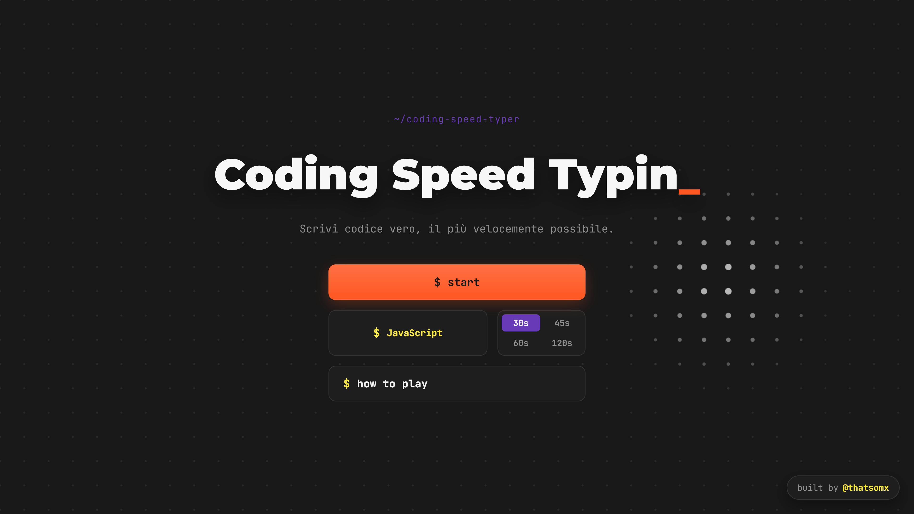

# ⌨️ Coding Speed Typin

Un test di velocità di digitazione pensato per chi programma: invece di
parole a caso, scrivi vere righe di codice. L'idea è semplice — prendere il
concept di MonkeyType e portarlo nel mondo dello sviluppo, con un'estetica
ispirata a un editor come VS Code.

🔗 **Prova la demo live:** [coding-speed-typer-i53nsm3u7-thatsomxx.vercel.app](https://coding-speed-typer-i53nsm3u7-thatsomxx.vercel.app/)



## 👋 Il progetto

Ciao, sono Omar! Studente di Informatica all'Università di Pisa, con un
interesse particolare per l'incontro tra sviluppo Front-End e Design
UI/UX. Questo è uno dei miei primi progetti personali, nato per mettere in
pratica in modo concreto quello che sto imparando — HTML5, CSS3,
JavaScript/TypeScript — con un occhio di riguardo per la cura dell'interfaccia
e dell'esperienza utente, non solo per la logica dietro le quinte.

## ✨ Funzionalità

- 🌐 Scelta del linguaggio: JavaScript, TypeScript, Python, Java o C++
- ⏱️ Durata del test selezionabile: 30 / 45 / 60 / 120 secondi
- 🔴 Countdown di 3 secondi con anteprima del codice sottostante
- ⌨️ Feedback visivo in tempo reale (carattere corretto, errore, non ancora scritto)
- 📊 Resoconto finale dinamico: WPM, precisione, errori, caratteri corretti,
  ciascuno con un piccolo ⓘ che spiega cosa significa
- 🎬 Transizioni fluide fra le schermate (View Transition API)
- 🎨 Estetica ispirata a un editor di codice: palette scura, puntini di
  sfondo reattivi al mouse, bottoni con effetto luminoso reattivo

## 🛠️ Stack & strumenti usati

- **Web Development:** React, TypeScript, Vite
- **UI/UX & Visual:** Design system scuro custom, animazioni CSS, View
  Transition API, Canvas API (per lo sfondo interattivo)
- **Strumenti:** Git/GitHub, Vercel (deploy continuo)

## 💻 Sviluppo in locale

```bash
npm install
npm run dev
```

Apri `http://localhost:5173` (o la porta indicata nel terminale).

## 📦 Build di produzione

```bash
npm run build
npm run preview   # per testare la build in locale
```

## 🌐 Deploy

Il sito è pubblicato gratuitamente su **Vercel**, collegato direttamente a
questa repo: ogni push su `main` genera automaticamente un nuovo deploy.
È incluso anche un workflow (`.github/workflows/deploy-pages.yml`) per
pubblicare in alternativa su GitHub Pages.

## 📄 Licenza

Distribuito con licenza [MIT](./LICENSE): puoi usarlo, modificarlo e
distribuirlo liberamente.

Non è richiesta alcuna attribuzione, ma se questo progetto ti è stato utile
una ⭐ alla repo o una email a **oechcherrate@gmail.com** mi farebbe piacere!

---

🔗 GitHub: [@thatsomx](https://github.com/thatsomx)
